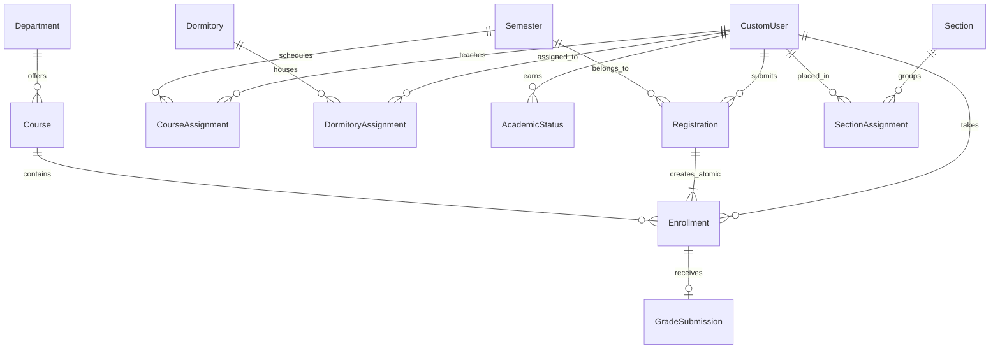

<div align="center">

# 🏛️ Campus Hub — Academic Operations Platform

**A full-stack, enterprise-grade university academic management platform built with Django REST Framework and React.**

[](https://www.djangoproject.com/)
[](https://www.django-rest-framework.org/)
[](https://react.dev/)
[](https://www.postgresql.org/)
[](http://whitenoise.evans.io/)
[](https://django-rest-framework-simplejwt.readthedocs.io/)
[](LICENSE)

[Architecture](#architecture--system-design) • [Interactive Demos](#interactive-demo-testing) • [Local Setup](#local-development-setup) • [API Reference](#api-reference)

</div>

---

## 📑 Table of Contents

- [Overview](#overview)
- [Interface Screenshots](#interface-screenshots)
- [Multi-Color Light Design System](#multi-color-light-design-system)
- [Interactive Demo Testing](#interactive-demo-testing)
- [Architecture & System Design](#architecture--system-design)
- [Features by Role](#features-by-role)
- [Academic Rules Engine](#academic-rules-engine)
- [Local Development Setup](#local-development-setup)
  - [Backend Setup](#backend-setup)
  - [Frontend Setup](#frontend-setup)
  - [Running Automated Tests](#running-automated-tests)
- [API Reference & Security](#api-reference--security)
- [Project Structure](#project-structure)
- [License & Author](#license--author)

---

## Overview

**Campus Hub** is an institutional academic management system that mirrors real-world university registrar and faculty workflows. The platform orchestrates the complete student lifecycle — from semester configuration, department catalogs, and course registration to atomic enrollment approvals, mark-to-grade conversions, cumulative GPA calculations, and dormitory room allocations.

Every business rule is enforced at the database and transaction level — not merely in the UI — preventing invalid course enrollments, duplicate registrations, capacity oversubscription, or grade inconsistencies.

---

## 📸 Interface Screenshots

<div align="center">

### Student Academic Dashboard
*Real-time Semester & Cumulative GPA tracking, enrolled courses roster, and academic standing.*
<br/>


<br/>

### Administrator Operations Console
*Comprehensive registrar management: active semester controls, department counts, and student/faculty registries.*
<br/>


<br/>

### Faculty Grade Entry & Submission
*Active course rosters with 0–100 numerical mark input and instant, automated letter grade & quality point derivation.*
<br/>


<br/>

### Student Course Registration
*Course catalog browsing, semester registration requests, and credit limit validation.*
<br/>


<br/>

### Faculty Teaching Roster & Audit Portal
*Course assignments, enrolled student rosters, and grade change audit request feed.*
<br/>


<br/>

### Gatekeeper Authentication & Demo Access
*Secure JWT authentication gateway with 1-click test persona autofill.*
<br/>


</div>

---

## Multi-Color Light Design System

Campus Hub features a bespoke, multi-color light design system:
- **Base Canvas**: Soft slate `#f8fafc` with crisp white cards (`#ffffff`) and subtle structural borders (`#e2e8f0`).
- **High-Contrast Typography**: Slate-900 (`#0f172a`) headers, slate-700 (`#334155`) body, and slate-500 (`#64748b`) metadata labels.
- **Distinct Role & Department Identities** (strictly non-monochrome / anti-uni-color):
  - 🎓 **Student / Dave**: Soft Sky Blue (`#f0f9ff` bg, `#bae6fd` border, `#0284c7` text, `#0369a1` accent)
  - 👩‍🎓 **Freshman Enrollee / Ella**: Soft Lilac Rose (`#fdf4ff` bg, `#f5d0fe` border, `#7c3aed` text, `#a21caf` accent)
  - 👨‍🏫 **Faculty / Dr. Yared**: Soft Mint Emerald (`#ecfdf5` bg, `#a7f3d0` border, `#059669` text, `#047857` accent)
  - 🛡️ **Dean & Registrar / Admin**: Soft Warm Amber-Gold (`#fffbeb` bg, `#fde68a` border, `#d97706` text, `#b45309` accent)
  - 🏛️ **Primary Brand & CTAs**: Academic Royal Sapphire & Cobalt gradient (`linear-gradient(135deg, #1d4ed8, #2563eb)`).

---

## Interactive Demo Testing

Campus Hub includes turnkey, 1-click interactive demo testing inspired by modern SaaS platforms:

### 1. Gatekeeper Sign-In Quick-Pills
The Sign-In portal loads with clean, empty inputs for manual login, and features 4 pastel persona cards that automatically populate credentials with 1 click:

| Persona | Role | Credentials | Starting State & Purpose |
| :--- | :--- | :--- | :--- |
| 🎓 **Dave Daniel** | Student | `student.dave` / `student123` | **3.80 GPA • Enrolled**: View completed course transcripts, GPA card, and allocated dormitory room. |
| 👩‍🎓 **Ella Smith** | Freshman | `student.ela` / `student123` | **Pending Registration**: Test the student-to-admin approval flow and course request review. |
| 👨‍🏫 **Dr. Yared Assefa** | Faculty | `teacher.yada` / `teacher123` | **Computing Faculty**: View class rosters, submit numerical marks (0–100), and initiate grade audits. |
| 🛡️ **Dean Administrator** | Admin / Registrar | `admin` / `admin123` | **System Registrar**: 1-click approve/reject registrations, manage semesters, sections, dorms, and course assignments. |

### 2. In-App Interactive Sandbox Ribbon
When signed into the portal, a persistent multi-color sandbox bar allows evaluators to toggle between Student, Faculty, and Admin roles in 1 click without logging out:
$$\text{Student Submits Request} \longrightarrow \text{Admin Approves Registration} \longrightarrow \text{Teacher Submits Grade} \longrightarrow \text{Student Views GPA/Standing}$$

### 3. Automated Idempotent Seeding
```bash
python manage.py seed_demo_data
```
Synchronizes 4 academic departments, 2 semesters, 10 catalog courses, class sections, dormitory allocations, faculty assignments, and all 4 demo personas in a single command.

---

## Architecture & System Design

Campus Hub employs a decoupled Client-Server architecture with strict role-based separation:

```
┌────────────────────────────────────────────────────────┐
│                   React 18 Frontend                    │
│   (Multi-Color Light UI • SPA Router • Live GPA Tool)  │
└───────────────────────────┬────────────────────────────┘
                            │ HTTPS / JWT Bearer
┌───────────────────────────▼────────────────────────────┐
│              Django REST Framework (Backend)           │
│   (Gunicorn WSGI • SimpleJWT Auth • WhiteNoise Static) │
└─────────────┬────────────────────────────┬─────────────┘
              │ Database Transactions      │
┌─────────────▼───────────────┐ ┌──────────▼─────────────┐
│  PostgreSQL (Production)    │ │   SQLite3 (Local Dev)  │
└─────────────────────────────┘ └────────────────────────┘
```

### Entity Relationship Model



---

## Features

### Student
- Register for courses each semester (one registration per semester enforced)
- View registration status (Pending / Approved / Rejected)
- Re-register after rejection
- Browse course catalog filtered by department
- View grades per semester with GPA tracking
- View cumulative GPA and academic standing (Active / Probation / Dismissed)
- View assigned dormitory building and room number
- Edit personal profile

### Teacher
- View assigned courses for the active semester
- See enrolled student roster per course
- Submit marks (0–100) — letter grade auto-calculated
- Request grade changes for already-submitted grades
- View academic standing of students in their courses

### Admin
- Full user management — create, edit, delete students and teachers
- Semester management — create, activate, and manage semesters
- Section management — create sections and assign students
- Course assignment — assign teachers to courses per semester
- Dormitory management — create rooms and assign students (gender-restricted, capacity-limited)
- Approve or reject student registration requests
- Approve or reject teacher grade change requests
- System overview dashboard

---

## Tech Stack

**Backend**
- Python 3.10+ / Django 6.x
- Django REST Framework
- Simple JWT (token-based authentication)
- django-cors-headers
- PostgreSQL (production) / SQLite (development)
- python-decouple (environment configuration)
- dj-database-url (dynamic database connection strings)
- Whitenoise (compressed static file serving)
- Gunicorn (production WSGI server)

**Frontend**
- React 18
- React functional components with hooks
- Fetch API with dynamic `API_BASE` resolution
- Responsive CSS-in-JS + custom dark theme design system
- DM Sans font (Google Fonts)

---

## Project Structure

```
campus-hub/
├── render.yaml                         # 1-Click Render Blueprint (Backend + Postgres)
├── Backend/
│   └── backend/
│       ├── .env.example                # Backend environment configuration template
│       ├── build.sh                    # Production build script (migrate, collectstatic, seed)
│       ├── Procfile                    # Gunicorn entrypoint for cloud hosting
│       ├── requirements.txt            # Python dependencies (UTF-8)
│       ├── manage.py                   # Django management script
│       ├── academic/                   # Courses, enrollments, grades, sections, GPA
│       │   └── management/commands/    # seed_demo_data command
│       ├── api/                        # ViewSets, serializers, permissions, URLs, tests.py
│       ├── backend/                    # Django settings (decouple, dj_database_url), root URLs
│       ├── dormitory/                  # Dormitory rooms and student assignments
│       ├── registration/               # Course registration requests and approval flow
│       └── user/                       # Custom user model, JWT serializer
│
└── Frontend/
    ├── .env.example                    # Frontend environment configuration template
    ├── vercel.json                     # Vercel SPA routing rewrite rules
    ├── package.json                    # Frontend dependencies and build scripts
    └── src/
        ├── api.js                      # Base fetch helper + dynamic API_BASE + demoLogin
        ├── App.jsx                     # Root component, router, sidebar & in-app demo switcher
        ├── LandingPage.jsx             # Modern marketing landing page & live GPA sandbox
        ├── Login.jsx                   # Sign-in portal with 1-click demo accounts
        ├── StudentDashboard.jsx        # Student home screen
        ├── TeacherDashboard.jsx        # Teacher home screen
        ├── AdminDashboard.jsx          # Admin home screen
        ├── RegistrationPage.jsx        # Student course registration
        ├── GradeSubmissionPage.jsx     # Teacher grade submission
        ├── GradesHistoryPage.jsx       # Student grade history
        ├── StudentStatusPage.jsx       # Teacher view of student standing
        ├── CoursesPage.jsx             # Course and department browser
        ├── ProfilePage.jsx             # User profile view and edit
        ├── SemesterManagementPage.jsx  # Admin semester CRUD
        ├── UserManagementPage.jsx      # Admin user CRUD
        ├── SectionManagementPage.jsx   # Admin section and assignment management
        ├── CourseAssignmentPage.jsx    # Admin teacher-to-course assignment
        └── DormitoryManagementPage.jsx # Admin dormitory management
```

---

## Getting Started

### Prerequisites

- Python 3.10+
- Node.js 18+ and npm
- Git

---

### Backend Setup

**1. Clone the repository**

```bash
git clone https://github.com/devbiniyam/campus-hub.git
cd campus-hub
```

**2. Create and activate a virtual environment**

```bash
# Windows (PowerShell)
python -m venv .venv
.venv\Scripts\activate

# macOS / Linux
python3 -m venv .venv
source .venv/bin/activate
```

**3. Install dependencies**

```bash
cd Backend/backend
pip install -r requirements.txt
```

**4. Run migrations & seed demo data**

```bash
python manage.py migrate
python manage.py seed_demo_data
```

**5. Start the Django server**

```bash
python manage.py runserver
```

The REST API will be live at `http://127.0.0.1:8000/api/`

---

### Frontend Setup

**1. Open a new terminal and navigate to Frontend**

```bash
cd Frontend
```

**2. Install dependencies**

```bash
npm install
```

**3. Start the React development server**

```bash
npm start
```

The web application will open at `http://localhost:3000` with the landing page, demo gateway, and live sandbox switcher.

---

### Running Automated Tests

Run the comprehensive Django REST Framework test suite (verifying authentication, registrations, permissions, and seeding):

```bash
cd Backend/backend
python manage.py test api
```

Expected result:
```
Ran 6 tests in ~15s
OK
```

---

### Configuration

Optional environment variables:

| Variable | Description | Default |
| :--- | :--- | :--- |
| `SECRET_KEY` | Django cryptographic signing key | Insecure dev key |
| `DEBUG` | Enable debug mode (`True` / `False`) | `True` |
| `DATABASE_URL` | Database connection URI (PostgreSQL or SQLite) | None *(uses local SQLite)* |
| `ALLOWED_HOSTS` | Comma-separated allowed hostnames | `*,localhost,127.0.0.1` |
| `REACT_APP_API_BASE` | Base URL for frontend REST API endpoints | `http://127.0.0.1:8000/api` |

---

## API Reference & Security

All private endpoints require a JSON Web Token (JWT) passed in the `Authorization` header:
```
Authorization: Bearer <your-access-token>
```

### 1. Authentication Flow
```bash
# 1. Obtain JWT Access & Refresh Tokens
curl -X POST http://127.0.0.1:8000/api/auth/login/ \
  -H "Content-Type: application/json" \
  -d '{"username": "student.dave", "password": "student123"}'

# Response:
# {"refresh": "...", "access": "eyJhbGciOiJIUzI1NiIsInR5cCI6IkpXVCJ9..."}

# 2. Fetch Authenticated User Profile
curl http://127.0.0.1:8000/api/users/me/ \
  -H "Authorization: Bearer <access_token>"
```

### 2. Core REST Endpoints

| Method | Endpoint | Access Level | Description |
| :--- | :--- | :--- | :--- |
| `POST` | `/api/auth/login/` | Public | Authenticates credentials and returns JWT token pair |
| `GET` | `/api/users/me/` | Authenticated | Retrieves profile of currently authenticated user |
| `GET` / `POST` | `/api/users/` | Admin Only | List, filter, or create new university users |
| `GET` / `POST` | `/api/semesters/` | Auth / Admin | View all semesters; create or activate new term |
| `GET` / `POST` | `/api/departments/` | Auth / Admin | University academic departments catalog |
| `GET` / `POST` | `/api/courses/` | Public / Admin | Browse active courses (public) or manage catalog (admin) |
| `GET` / `POST` | `/api/course-assignments/`| Faculty / Admin| Assign teachers to course sections per semester |
| `GET` / `POST` | `/api/registrations/` | Student / Admin | Student submits course registration request |
| `POST` | `/api/registrations/{id}/approve/` | Admin Only | Atomically approves request and creates enrollments |
| `POST` | `/api/registrations/{id}/reject/` | Admin Only | Rejects request with audit remarks |
| `GET` | `/api/enrollments/` | Role-filtered | View course enrollments by student or teaching faculty |
| `POST` | `/api/grade-submissions/` | Faculty Only | Submit marks (0–100); auto-calculates letter grade |
| `GET` / `POST` | `/api/grade-change-requests/` | Faculty / Admin | Request audit modification on already-submitted grades |
| `POST` | `/api/grade-change-requests/{id}/approve/` | Admin Only | Approves audit and automatically updates student GPA |
| `GET` / `POST` | `/api/sections/` | Auth / Admin | Lecture and lab section management |
| `GET` / `POST` | `/api/section-assignments/` | Auth / Admin | Student section cohort placements |
| `GET` | `/api/academic-status/` | Role-filtered | View semester GPA, cumulative CGPA, and standing |
| `GET` / `POST` | `/api/dormitories/` | Auth / Admin | View dormitory blocks and room capacities |
| `GET` / `POST` | `/api/dormitory-assignments/` | Auth / Admin | Student residential dormitory allocations |

---

## Role-Based Access Control (RBAC)

Campus Hub enforces granular, role-based permissions at the database query level:

| Feature / Capability | Student | Faculty | Administrator |
| :--- | :---: | :---: | :---: |
| Access Personalized Dashboard | ✅ | ✅ | ✅ |
| Submit Course Registration | ✅ | ❌ | ❌ |
| View Transcript & Cumulative GPA | ✅ | ❌ | ❌ |
| View Assigned Teaching Rosters | ❌ | ✅ | ❌ |
| Submit Student Marks (0–100) | ❌ | ✅ | ❌ |
| Initiate Grade Revision Audit | ❌ | ✅ | ❌ |
| Approve / Reject Registrations | ❌ | ❌ | ✅ |
| Approve Grade Revisions | ❌ | ❌ | ✅ |
| Manage Departments & Catalog | ❌ | ❌ | ✅ |
| Allocate Dormitories & Sections | ❌ | ❌ | ✅ |
| User Provisioning & Deactivation | ❌ | ❌ | ✅ |

---

## Academic Rules Engine

### Grading Scale & Quality Points
Marks submitted between 0 and 100 are automatically converted into standard letter grades and quality points:

| Percentage Range | Letter Grade | Grade Points (4.0 Scale) | Classification |
| :--- | :---: | :---: | :--- |
| **90% – 100%** | `A+` | **4.00** | Excellent / First Class Honours |
| **85% – 89%** | `A` | **4.00** | High Distinction |
| **80% – 84%** | `A-` | **3.75** | Distinction |
| **75% – 79%** | `B+` | **3.50** | Very Good |
| **70% – 74%** | `B` | **3.00** | Good |
| **65% – 69%** | `B-` | **2.75** | Satisfactory |
| **60% – 64%** | `C+` | **2.50** | Average |
| **50% – 59%** | `C` | **2.00** | Pass |
| **45% – 49%** | `C-` | **1.75** | Marginal Failure |
| **40% – 44%** | `D` | **1.00** | Minimum Pass |
| **0% – 39%** | `F` | **0.00** | Fail |

### Academic Standing Policies
Calculated at the end of each completed semester:
- **Active / Good Standing**: $\text{GPA} \ge 2.00$
- **Academic Probation**: $1.75 \le \text{GPA} < 2.00$ *(Requires advisor review)*
- **Academic Dismissal**: $\text{GPA} < 1.75$ *(Course registration blocked)*

---

## 📄 License & Author

- **Author**: [Biniyam Girma](https://github.com/devbiniyam)
- **Repository**: [https://github.com/devbiniyam/campus-hub](https://github.com/devbiniyam/campus-hub)
- **License**: MIT License — open for academic, commercial, and research use.

